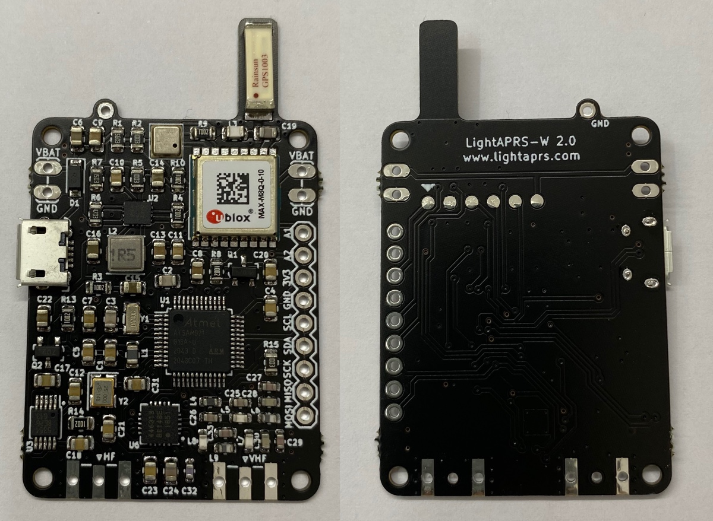
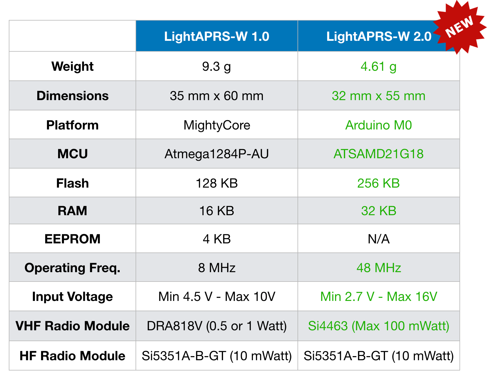
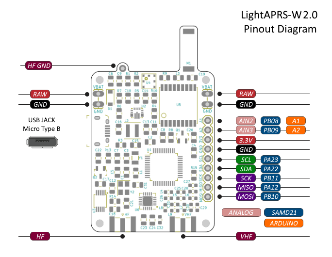
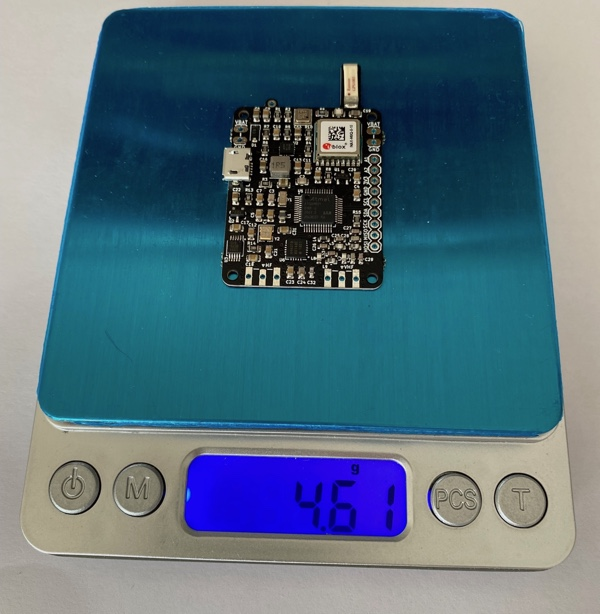
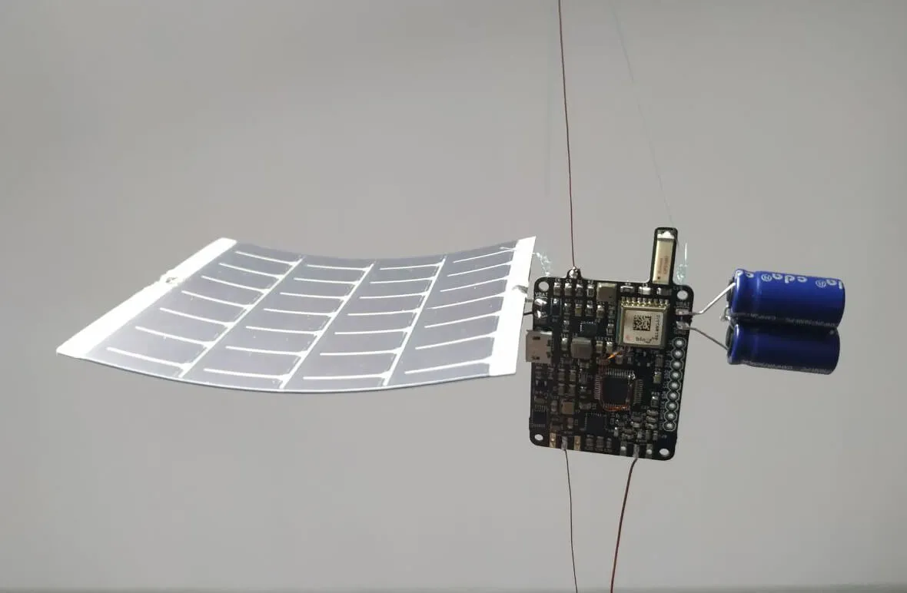

# LightAPRS-W 2.0 WSPR Tracker

LightAPRS-W 2.0 is an affordable, smallest, lightest, powerful and open source APRS tracker with WSPR. It makes tracking pico balloons simple and easy. 
It is able to report location, altitude, temperature and pressure to the internet ([APRS-IS](http://status.aprs2.net)) or direct to an amateur radio once a minute with a solar panel/supercapacitors or just 3xAAA batteries. 
Because LightAPRS W-2.0 is open source you can add your own custom sensors via I2C/SPI pins.

**LightAPRS-W 2.0** is upgraded (smaller, lighter, powerful but power consumption is lower) version of [LightAPRS-W 1.0](https://github.com/lightaprs/LightAPRS-W-1.0). We don't use Dorji DRA818V radio module for VHF (APRS) any more and developed our own VHF radio module and that made LightAPRS-W-2.0 smaller and lighter. DRA818V radio module was very powerful (1 Watt) but actually pico balloon trackers do not need 1 Watt since it draws so much power. Our new VHF Radio module for APRS (based on Si4463) is 100 mWatt and more convenient for airborne projects since power consumption is much much lower.

LightAPRS-W 2.0 will be available on http://shop.qrp-labs.com/aprs/ for order soon. If you don't need WSPR, than check out APRS only tracker [LightAPRS](https://github.com/lightaprs/LightAPRS-1.0) or LoRa/LoRaWAN only tracker [LightTracker](https://github.com/lightaprs/LightTracker-1.0).

**Important :** LightAPRS-W 2.0 uses the amateur 2 meter (VHF) and 10m+ (HF) radio band which requires an amateur radio license to operate.
 
## Basic Features 
- **Software** : Open Source
- **Weight** : 4.61 grams
- **Dimensions**    : 32 mm x 55 mm
- **IDE** : Arduino
- **Platform** : ARM Cortex-M0 (Arduino M0)
- **MCU** : ATSAMD21G18
- **Flash** : 256 KB
- **Ram** : 32 kB
- **EEPROM** : N/A
- **Operating Frequency** : 48 Mhz
- **Operating Voltage** : 3.3 Volt
- **Input Voltage** : 2.7 (min) - 16 (max) Volt via USB or VBat pin (Buck-Boost regulator with power good)
- **BOD** : N/A
- **Sensor** : BMP180 (pressure and temperature)
- **VHF Radio Module** : Si4463
- **VHF Radio Operating Frequency** : 144-146 MHz (configurable by code)
- **VHF Low Pass Filter** : Available (7 elements)
- **VHF Radio Power**  : 100 mW (max) (configurable by software)
- **VHF Power Consumption (TX)** : ~55 mA (100 mW)
- **HF Radio Module** : [Si5351A-B-GT](https://www.silabs.com/products/timing/clocks/cmos-clock-generators/device.si5351a-b-gt) (included)
- **HF Radio Operating Frequency** : 2.5kHz - 200Mhz (configurable by code)
- **HF Low Pass Filter** : No

- **HF Radio Power**  : ~10mW
- **CPU Power Consumption (Idle)** : ~7 mA
- **GPS** : Ublox MAX-M8Q (GPS-GLONASS)
- **GPS Antenna Gain** : 4.3 dBi
- **Extended Pins** : I2C, SPI, 2x Analog

## Configuration

To programme LightAPRS-W 2.0 Tracker, all you need is a micro usb (B type) cable, a few installations and configurations.

### 1.Install Arduino IDE

Download and install [Arduino IDE](https://www.arduino.cc/en/Main/Software). If you have already installed Arduino, please check for updates. Its version should be at least v1.8.13 or newer.

### 2.Configure Board

- Open the **Tools > Board > Boards Manager...** menu item as follows:

- Type "Arduino SAMD" in the search bar until you see the **Arduino SAMD Boards (32-Bits Arm Cortex-M0+)** entry and click on it.

- Click **Install** .
- After installation is complete, close the **Boards Manager** window.
- Open the **Tools > Board** menu item and select **Arduino SAMD Boards (32-Bits Arm Cortex-M0+) -> Arduino M0** from the the list as follows:

### 3.Copy Libraries & Compile Source Code 

You are almost ready to programme LightAPRS-W 2.0 Tracker :)

- First download the repository to your computer using the green "[clone or download](https://github.com/lightaprs/LightAPRS-W-2.0/archive/refs/heads/main.zip)" button.
- There are more than one Arduino projects optimized for different use cases. For example if you are planning to use the LightAPRS-W-2.0 tracker for a pico balloon project, then use the "[LightAPRS-W-2-pico-balloon](LightAPRS-W-2-pico-balloon)" folder.
- You will notice some folders in the "libraries" folder. You have to copy these folders (libraries) into your Arduino libraries folder on your computer. Path to your Arduino libraries:
- **Windows** : This PC\Documents\Arduino\libraries\
- **Mac** : /Users/\<username\>/Documents/Arduino/libraries/ 

**IMPORTANT :** LightAPRS-W 2.0 uses additional libraries than LightAPRS and LightAPRS-W. So if you purchased LightAPRS or LightAPRS-W and copied libraries before, do it again for LightAPRS-W 2.0. Otherwise you get a compile error.

- Then open the *.ino file with Arduino IDE and change your settings (Callsign, SSID, comment, etc.)
- Click **Verify** (If you get compile errors, check the steps above)

### 4.Upload

- First attach an VHF antenna (at least 50cm monopole wire) to your tracker. Radio module may be damaged when not attaching an antenna, since power has nowhere to go. 
- Connect LightAPRS-W 2.0 Tracker to your computer with a micro USB cable, then you should see a COM port under **Tools->Port** menu item. Select that port. 

- Click **Upload**

- Your tracker is ready to launch :)

### Support

If you have any questions or need support, please contact support@lightaprs.com

### Wiki

* **[F.A.Q.](https://github.com/lightaprs/LightAPRS-W-2.0/wiki/F.A.Q.)**
* **[Tips & Tricks for Pico Balloons](https://github.com/lightaprs/LightAPRS-W-2.0/wiki/Tips-&-Tricks-for-Pico-Balloons)**
